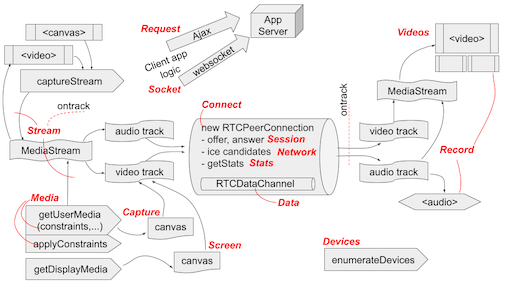
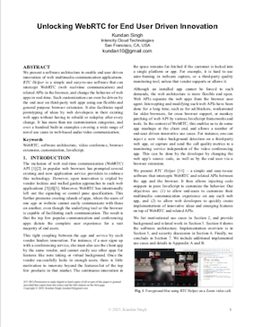
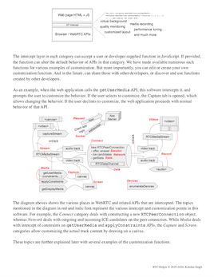
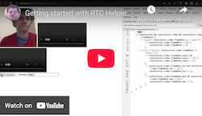

# RTC Helper

This is a simple and easy-to-use software that can intercept WebRTC (web real-time
communication) and related APIs in the browser, and change the behavior of web apps
in real-time. It allows you to analyze, customize and improve audio/video 
communication on third-party websites as well as your own web apps.

Two main goals of this project are: (1) to allow end-user customization of WebRTC
experience, without depending on the features provided or supported by the
third-party websites, and (2) to allow developers to rapidly create 
proof-of-concept (PoC) of innovative ideas and emerging features built on top
of WebRTC.

Please watch the [video on project motivation](https://youtu.be/iYRRuJcgx6s), 
and view the related [presentation material](https://kundansingh.com/talks/2026-rtchelper) below. There is also a [demonstration video](https://youtu.be/A5OXQznagxs)
of the user friendly project, RTC Camera and Screen, which shows a subset
of the features, such as virtual camera for third-party web video conferencing
apps.

| Presentation video | 3D Slides | Virtual camera demo |
|:-----:|:-----:|:-----:|
|  |  |  |

Please see our research paper 
[Unlocking WebRTC for End User Driven Innovation](https://doi.org/10.48550/arXiv.2512.23688)
for this project's motivation, background, related work, and an overview of
its software architecture. The paper also lists several examples of end user
driven innovation enabled by this software.
The software includes an [extensive documentation](docs/help.pdf), and this can also be
printed from the help tab of the options panel.

Please checkout the Youtube video on [getting started](https://youtu.be/A7RUuiF8iQ4)
with this project, and a walk-through of many of the included examples. I highly
recommend watching the video, if you are a developer or end user interested in trying out
this project. It is an hour long video, but only the first fifteen minutes is enough
to get started.

| Research Paper | Documentation PDF | Getting started video |
|:-----:|:-----:|:-----:|
|  |  |  |

<!--

{:target="_blank"}
-->

Since this browser extension will not be published on the official extension/web store,
the end users who are interested in using this software on third-party websites will
also need to install it in developer mode. Detailed instructions
are in the documentation PDF and getting started video mentioned above.
The summary of steps to install the extension is as follows:

  1. Create a new browser profile in Google Chrome. This is to avoid interfering
     with your regular browsing activity.
  1. Open chrome://extensions in the browser. This is the browser's extensions page.
  1. Click to enable the developer mode on the top right of the page. This allows
     loading an extension outside of the official extension/web store.
  1. Download the [rtchelper.zip](rtchelper.zip) or [rtccamera.zip](rtccamera.zip)
     file containing this project's browser extension.
  1. Open file explorer or finder on your machine. Locate the downloaded ZIP file,
     and drag it to the browser's extension page with developer mode enabled.
  1. This should install the extension on that browser profile. Use the extension 
     icon next to the address bar, to select and pin the newly installed extension.

This software is still in its early stage. It is in &ldquo;demo quality&rdquo;, i.e., good enough
for showing a demo, but not good enough for independent use without supervision.
If you are interested in sponsoring this project, or hiring (contract work) for
integration with your system, please reach out to the owner by email, mentioned
at the end of this document. You can also join the 
[project support and discussion group](https://groups.google.com/u/1/g/theintencity)
for all our projects.

# License, copyright and contributions

The core software is released under dual license: AGPL (GNU Affero General Public License) as well as
Alternative commercial license. See [LICENSE](LICENSE) for details. This is similar in spirit to
MySQL's dual license, except that we use AGPL. The core software contains everything in this
repository, except for the customization functions' sample code of `functions.js`.

The single file named `functions.js`, that contains many customization functions, is considered
outside the core software, and is released under a permissive MIT license, as mentioned in that file.
This allows anyone to use any of the hundreds of sample code from that single file in their project
without the AGPL restrictions.

I would like to promote open source. However, I have witnessed gross misuse of the open source
intent in the industry, especially in software-as-a-service offerings. Therefore, I decided to use
AGPL as the baseline license. This is quite restrictive for most commercial settings. Therefore
I decided to also offer an alternative low cost commercial license for such use. 

In summary, if you keep this software to yourself, or make your whole product or service open-source,
then AGPL is fine; if you want to sell your own software with pieces of this project inside, even
if you are offering software-as-a-service or a cloud hosted product, you'll likely need to buy the
alternative commercial license.

The alternative license is available for commercial and non-personal use at a small price,
independent of any usage size or pattern, by contacting the software owner mentioned below. This
alternative license allows you to sell the software pieces of this project to your customers bundled
with your own closed source product, or use these software pieces with your cloud hosted service
offering to your customers without much restrictions, with the main exception that no reselling of
those sofware pieces of this project is allowed, without a new paid commercial license.

Software owner is **Kundan Singh ([theintencity@gmail.com](mailto:theintencity@gmail.com))**.
All pieces of this software including source code, documentation, and binaries are copyright
protected as *&copy; 2025-2026, Kundan Singh &lt;theintencity@gmail.com&gt;*. Please see LICENSE about
transfer of ownership of contributions, if you would like to contribute to this project.
